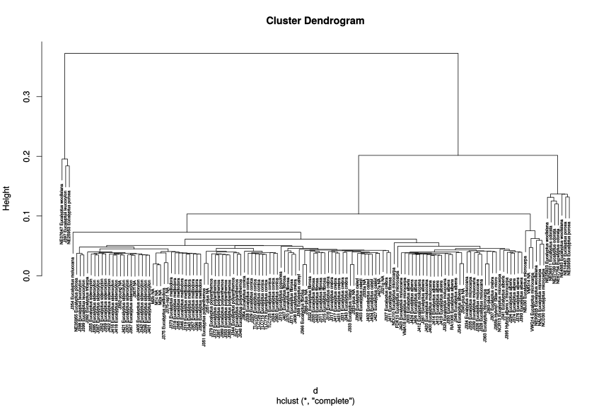
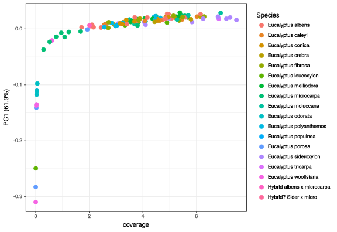
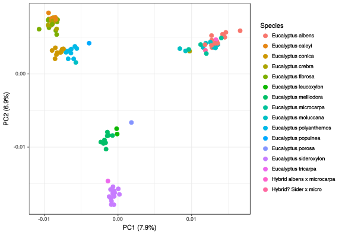
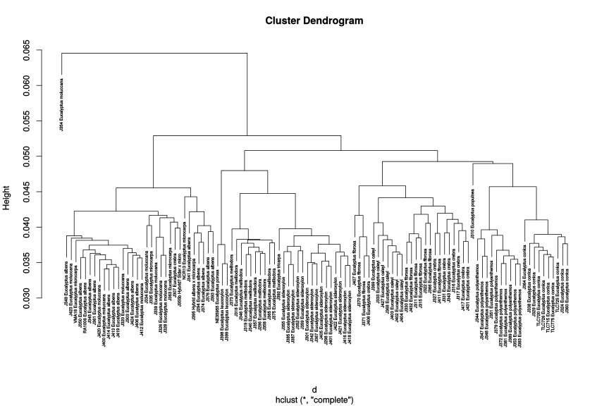
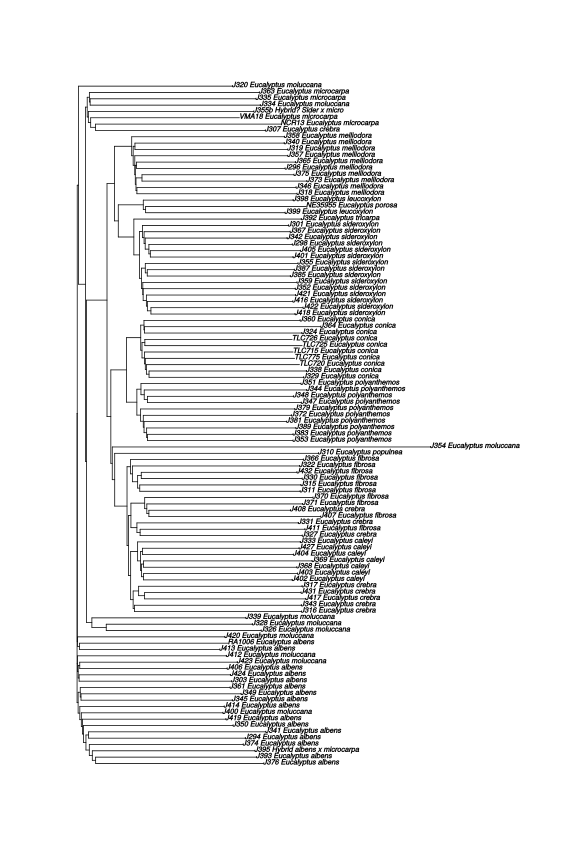

# 2017-04-23 -- Identify adapter sequences

Identifying adapters. Used command:

```
AdapterRemoval \
    --file1 <(cat rawdata/plate1.1/*_R1_001.fastq.gz) \
    --file2 <(cat rawdata/plate1.1/*_R2_001.fastq.gz) \
    --basename data/tmp/J366 \
    --identify-adapters \
    --threads 16
```

The adapters didn't seem to match very well. So then I did the following, using
the consensus sequences from the above as the adaptor sequences.

```
AdapterRemoval \
    --file1 <(cat rawdata/plate1.1/*_R1_001.fastq.gz) \
    --file2 <(cat rawdata/plate1.1/*_R2_001.fastq.gz) \
    --basename data/tmp/J366 \
    --identify-adapters \
    --threads 16 \
    --adapter1 CTGTCTCTTATACACATCTCCGAGCCCACGAGACACCAGCAAATCTCGTATGCCGTCTTCTGCTTG \
    --adapter2 CTGTCTCTTATACACATCTGACGCTGCCGACGAGCATGGTTGTGTAGATCTCGGTGGTCGCCGTATCATT
```


Got the following:

```
Attemping to identify adapter sequences ...
Processed a total of 888,338,056 reads in 51:05.0s; 289,000 reads per second on average ...
   Found 300478797 overlapping pairs ...
   Of which 69039098 contained adapter sequence(s) ...

Printing adapter sequences, including poly-A tails:
  --adapter1:  CTGTCTCTTATACACATCTCCGAGCCCACGAGACACCAGCAAATCTCGTATGCCGTCTTCTGCTTG
               ||||||||||||||||||||||||||||||||||  |  |  ||||||||||||||||||||||||
   Consensus:  CTGTCTCTTATACACATCTCCGAGCCCACGAGACGACCACGGATCTCGTATGCCGTCTTCTGCTTGAAAAAAAAAAGGGGGGGGGGGGGGGGGGGGGGGGGGGGGGGGGGGGGGGGGGGGGGGGGGGGGGGGGGGATATT
     Quality:  24232323443422232122110112001/00.1""""""""-++(*.)+-+)-,()(,()-)(,,*.////.-,'&)++,,------------,,,,,,,,++++***))))(('''&&&%%%%$$###""""""""""

    Top 5 most common 9-bp 5'-kmers:
            1: CTGTCTCTT = 94.72% (57582672)
            2: ATGTCTCTT =  0.27% (166117)
            3: CTCTCTCTT =  0.19% (117518)
            4: CTGTCTATT =  0.17% (104399)
            5: CTGGCTCTT =  0.14% (87007)


  --adapter2:  CTGTCTCTTATACACATCTGACGCTGCCGACGAGCATGGTTGTGTAGATCTCGGTGGTCGCCGTATCATT
               |||||||||||||||||||||||||||||||||    |   |||||||||||||||||||||||||||||
   Consensus:  CTGTCTCTTATACACATCTGACGCTGCCGACGAAATGGAACGTGTAGATCTCGGTGGTCGCCGTATCATTAAAAAAAAAAGGGGGGGGGGGGGGGGGGGGGGGGGGGGGGGGGGGGGGGGGGGGGGGGGGGGAAAAAAAA
     Quality:  0202121227261516101/30/11/00/11/3"""""""".../4/2/./..-......--.-2.-2-.2322211/+'%'))****++++++++++********))))(((''&&&&&%%%%$$$##"""""""""""

    Top 5 most common 9-bp 5'-kmers:
            1: CTGTCTCTT = 91.99% (55859948)
            2: CTCTCTCTT =  0.74% (447814)
            3: ATGTCTCTT =  0.56% (338111)
            4: CTGACTCTT =  0.35% (215539)
            5: CTGTCTCTA =  0.34% (207612)
```

So, I now use these as the adapter sequences (the Ns are for the index
sequences):

```
--adapter1 CTGTCTCTTATACACATCTCCGAGCCCACGAGACNNNNNNNNATCTCGTATGCCGTCTTCTGCTTG
--adapter2 CTGTCTCTTATACACATCTGACGCTGCCGACGANNNNNNNNGTGTAGATCTCGGTGGTCGCCGTATCATT
```

And with this, we have the following:

```
Attemping to identify adapter sequences ...
Processed a total of 888,338,056 reads in 51:05.0s; 289,000 reads per second on average ...
   Found 300478797 overlapping pairs ...
   Of which 69039098 contained adapter sequence(s) ...

Printing adapter sequences, including poly-A tails:
  --adapter1:  CTGTCTCTTATACACATCTCCGAGCCCACGAGACNNNNNNNNATCTCGTATGCCGTCTTCTGCTTG
               ||||||||||||||||||||||||||||||||||********||||||||||||||||||||||||
   Consensus:  CTGTCTCTTATACACATCTCCGAGCCCACGAGACGACCACGGATCTCGTATGCCGTCTTCTGCTTGAAAAAAAAAAGGGGGGGGGGGGGGGGGGGGGGGGGGGGGGGGGGGGGGGGGGGGGGGGGGGGGGGGGGGATATT
     Quality:  24232323443422232122110112001/00.1""""""""-++(*.)+-+)-,()(,()-)(,,*.////.-,'&)++,,------------,,,,,,,,++++***))))(('''&&&%%%%$$###""""""""""

    Top 5 most common 9-bp 5'-kmers:
            1: CTGTCTCTT = 94.72% (57582672)
            2: ATGTCTCTT =  0.27% (166117)
            3: CTCTCTCTT =  0.19% (117518)
            4: CTGTCTATT =  0.17% (104399)
            5: CTGGCTCTT =  0.14% (87007)


  --adapter2:  CTGTCTCTTATACACATCTGACGCTGCCGACGANNNNNNNNGTGTAGATCTCGGTGGTCGCCGTATCATT
               |||||||||||||||||||||||||||||||||********|||||||||||||||||||||||||||||
   Consensus:  CTGTCTCTTATACACATCTGACGCTGCCGACGAAATGGAACGTGTAGATCTCGGTGGTCGCCGTATCATTAAAAAAAAAAGGGGGGGGGGGGGGGGGGGGGGGGGGGGGGGGGGGGGGGGGGGGGGGGGGGGAAAAAAAA
     Quality:  0202121227261516101/30/11/00/11/3"""""""".../4/2/./..-......--.-2.-2-.2322211/+'%'))****++++++++++********))))(((''&&&&&%%%%$$$##"""""""""""

    Top 5 most common 9-bp 5'-kmers:
            1: CTGTCTCTT = 91.99% (55859948)
            2: CTCTCTCTT =  0.74% (447814)
            3: ATGTCTCTT =  0.56% (338111)
            4: CTGACTCTT =  0.35% (215539)
            5: CTGTCTCTA =  0.34% (207612)
```

Which is a perfect match.

Googleing these gets you to
<https://github.com/fulcrumgenomics/fgbio/blob/master/src/main/scala/com/fulcrumgenomics/util/IlluminaAdapters.scala>.
That seems to suggest these are NextTera V2 adapters, which makes sense. Note
the `--adapter2` is the reverse compliment of what is on that site.

## Post script -- 2017-04-26

I did this with Norman's IAEA sequencing runs (done the same way) and got
exactly the same answer, so this is definitely solid.


# 2017-04-27 -- Mash re-run

Did a re-run of the MASH tree with k=21 and sketch size of 10000. This one
includes all the samples off plate 2, sans the blanks (and without merging tech
reps).



However, the mash tree does raise a couple of issues:

- The deepest branches seem to split off samples that were not collected by
  Jasmine (voucher nums not starting with J, I assume)
- There are a few samples without species annotation, meaning they're not in
  the metadata


# 2017-04-27 -- Metadata clean up

Read metadata into R notebook (in `edmund:ws/euc/metadata`). The Species column
had a bunch of odd stuff in it, typos mostly, and a few question marks that
I've removed for now. I have cleaned it up and output it as a CSV for use in
other places. The original species column is in there as `species.orig`.

However, It's missing the "series" or whatever taxonomic rank the various
supra-specific groups are. Need to get this off Rose/Jaz.


# 2017-05-01 -- Redoing the PCA visualisation

By eye, the mash tree seemed to suggest that the major axes of variation were
coverage driven. That lead me to plot PC1 against coverage:



Looks like PC1 is pretty coverage driven, especially at the low end.
Re-plotting the PCA without the crappy samples (coverage $\ge 1.5$x) gives the
following:







Seems as though the trees haven't changed much, we have just removed the
samples that make no sense.
