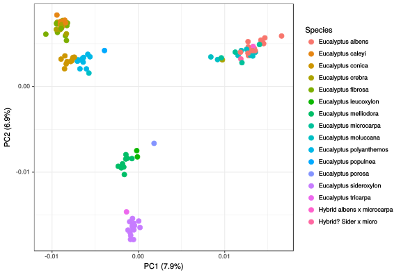
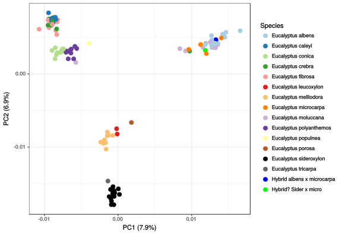

# 2017-05-24 -- Plotting read stats

```R
library(tidyverse)
library(ggplot2)
library(Cairo)

reads = read.delim("data/2017-05-24_readstats/readnum.tsv") %>%
    mutate(samp = sub("data/reads/(.+)\\.fastq\\.gz", "\\1", filename),
           cov = bases / 6e8) %>%
    select(-filename)
kmers = read.delim("data/2017-05-24_readstats/unique-kmers.tsv") %>%
    mutate(samp = sub("data/reads/(.+)\\.fastq\\.gz", "\\1", filename)) %>%
    select(-filename)
data = full_join(reads, kmers, by="samp")

p = ggplot(data, aes(x=cov, y=unique_kmers)) +
    geom_point() +
    theme_bw()

svg("data/2017-04-24_readstats.svg")
print(p)
dev.off()
```


From this we can see that coverage alone would be a pretty good determinant of
sampling quality. If there were low complexity libraries, we would see these
below the main curve. Based on this, I think we're good to pool samples
together, even if the replicates or individuals are not sufficiently covered on
their own (note this is NOT what's been done below for kWIP/mash).


# 2017-05-23 -- Terastructure tests

To run a simple test, I ran the following (from the root Snakemake directory).

```bash
for k in {2..11}
do
    terastructure  -label ts-test \
        -bed data/plink/ngm/grandis/nooutlier.bed \
        -k $k -nthreads 16
done
```

This created a bunch of files, copied to `data/2017-05-23_terastructure-test/`.

Let's plot these.

```R
ts = NULL
for (k in 2:11) {
    fn = paste0("data/2017-05-23_terastructure-test/n123-k", k, "-l8579612/theta.txt")
    d <- read.delim(fn, header=F)
    d <- d[,-ncol(d)] # The last column is always empty
    d$indiv <- 1:nrow(d)
    d <- gather(d, "popn", "theta", -indiv) %>%
            mutate(popn = sub("^V", "", popn),
                k=k,
                indiv=as.factor(indiv))
    ts <- bind_rows(ts, d)
}

p = ggplot(ts, aes(x=indiv, y=theta, fill=popn, colour=popn)) +
    geom_bar(stat="identity") +
    facet_wrap(~k, ncol=1) +
    scale_fill_brewer("Popn.", palette="Paired") +
    scale_colour_brewer("Popn.", palette="Paired") +
    labs(y="Proportion", x="Indiviual") +
    theme_bw() +
    theme(axis.text.x=element_text(angle=90, hjust=1))

svg("data/2017-05-23_terastructure.svg", width=8, height=12)
print(p)
dev.off()
```


What the hell!?!

I only explanations I can come up with for this is, a), a bug, or b), user
error. I've read the rather spartan docs, and I can't see how I'm doing this
wrong (naturally). I need to re-familiarise myself with the mathematics of
their take on the PSD model, and dig into the associated validation files to
see if there are any clues there. It seems as though the model could be getting
stuck in some initial state for $3 < k \le 11$.

I'm not encouraged by the fact that I had to fix a very obvious bug that would
have prevented anyone from using or testing terastructure with plink files. It
makes me thing that, a), I'm the first person to use this feature in a while,
and b), there are quite possibly less obvious bugs lurking here.

#### Rerun with different parameters

Increased the rfreq parameter to 100000, and not much changed.

```bash
for k in {2..11}
do
    terastructure  -label rfreq100k \
        -rfreq 100000 \
        -bed data/plink/ngm/grandis/nooutlier.bed \
        -k $k -nthreads 16
done
```

Reading the wiki, this should be 5-20% of the number of SNPs. Since that's more
than 100k, doing 3Mil which is ~20% of the ~10M SNPs.

```bash
for k in {2..11}
do
    terastructure  -label rfreq3M \
        -rfreq 3000000 \
        -bed data/plink/ngm/grandis/nooutlier.bed \
        -k $k -nthreads 16
done
```

That timed out, so re-doing with smaller rfreq and using qsub.

```bash
for k in {2..11}
do

qsub -l ncpus=16,mem=31G,walltime=18:00:00,wd -q express -N ts-$k -P xe2 <<EOS
module load terastructure;

terastructure \
     -label rfreq2M \
     -rfreq 2000000 \
     -bed data/plink/ngm/grandis/nooutlier.bed \
     -k $k -nthreads 16
EOS
done
```

# 2017-05-22 -- kWIP (& Mash) results

I've finally re-done the kWIP and mash results based on the non-outlier
samples.

```R
library(ggplot2)
library(tidyverse)
library(Cairo)
library(ape)
library(RColorBrewer)

col = c(brewer.pal(12, "Paired"), 'black', '#666666', 'blue', 'pink')

m = as.matrix(read.delim("data/2017-05-22_kwip-k21-s1e9/nooutlier.dist", row.names=1))
d = as.dist(m)

meta = read.csv("../metadata/cleaned/metadata.csv", stringsAsFactors=F)
meta = meta[match(rownames(m), meta$ID),]
```


#### PCoA on kWIP dist mat

We use PCoA/Classic MDS as this is required for mash (mash distances aren't
guaranteed to be euclidean), and mathematically identical to PCA with kWIP's
euclidean distances.

```R
pc = cmdscale(d, k=9, eig=T)
pctcontrib = pc$eig / sum(pc$eig)
pc = pc$points
pc.df = data.frame(PC1=pc[,1], PC2=pc[,2], ID=rownames(pc)) %>%
        left_join(meta, by="ID")

svg("data/2017-05-22_kwip-scree.svg")
plot(cumsum(pctcontrib), type='lp', main="Scree plot (kWIP)", xlab="PC",
        ylab="Proportion of variance (culmulative)")
dev.off()
```


#### PCA By Species

```R
p = ggplot(pc.df, aes(x=PC1, y=PC2)) +
    geom_point(aes(colour=species), size=3) +
    xlab(paste0("PC1 (", round(pctcontrib[1] * 100, 1), "%)")) +
    ylab(paste0("PC2 (", round(pctcontrib[2] * 100, 1), "%)")) +
    scale_color_manual(values = col) +
    theme_bw()
svg('data/2017-05-22_kwip-pca-spp.svg', width=7, height=5)
print(p)
dev.off()
```


#### PCA by series

```R
p = ggplot(pc.df, aes(x=PC1, y=PC2)) +
    geom_point(aes(colour=series), size=3) +
    xlab(paste0("PC1 (", round(pctcontrib[1] * 100, 1), "%)")) +
    ylab(paste0("PC2 (", round(pctcontrib[2] * 100, 1), "%)")) +
    scale_color_brewer(palette="Paired") +
    theme_bw()
svg('data/2017-05-22_kwip-pca-series.svg', width=7, height=5)
print(p)
dev.off()
```


#### PCA of Mash by series

```R
m = as.matrix(read.delim("data/2017-05-22_mash-k21-s1e5/nooutlier.dist", row.names=1))
d = as.dist(m)

meta = read.csv("../metadata/cleaned/metadata.csv", stringsAsFactors=F)
meta = meta[match(rownames(m), meta$ID),]

pc = cmdscale(d, k=9, eig=T)
pctcontrib = pc$eig / sum(pc$eig)
pc = pc$points
pc.df = data.frame(PC1=pc[,1], PC2=pc[,2], ID=rownames(pc)) %>%
        left_join(meta, by="ID")

svg("data/2017-05-22_mash-scree.svg")
plot(cumsum(pctcontrib), type='lp', main="Scree plot (Mash)", xlab="PC",
        ylab="Proportion of variance (culmulative)")
dev.off()

p = ggplot(pc.df, aes(x=PC1, y=PC2)) +
    geom_point(aes(colour=series), size=3) +
    xlab(paste0("PC1 (", round(pctcontrib[1] * 100, 1), "%)")) +
    ylab(paste0("PC2 (", round(pctcontrib[2] * 100, 1), "%)")) +
    scale_color_brewer(palette="Paired") +
    theme_bw()
svg('data/2017-05-22_mash-pca-series.svg', width=7, height=5)
print(p)
dev.off()

p = ggplot(pc.df, aes(x=PC1, y=PC2)) +
    geom_point(aes(colour=species), size=3) +
    xlab(paste0("PC1 (", round(pctcontrib[1] * 100, 1), "%)")) +
    ylab(paste0("PC2 (", round(pctcontrib[2] * 100, 1), "%)")) +
    scale_color_manual(values = col) +
    theme_bw()
svg('data/2017-05-22_mash-pca-spp.svg', width=7, height=5)
print(p)
dev.off()
```


# 2017-05-10 -- Get outlier set of samples

Find the means across all pairwise distances for all samples. Mask this at some
point such that J354 isn't included in the analysis (this being the odd outlier
mollucana). That ended up being at mean pairwise dist of 0.07.

```R

m = as.matrix(read.delim("data/2017-04-27_mash-euc-k21-s10000.dist", row.names=1))
d = as.dist(m)
cm = colMeans(m)
cmok = cm[cm < 0.07]

cat(names(cmok), sep="\n", file="data/2017-05-10_samples-pi-0.07.txt")

```

Also, do one at $\pi$ of 0.10, which includes the dodgy molluncana (J354) but
none of the really massive outliers driven by coverage.

```R

cmok = cm[cm < 0.1]
cat(names(cmok), sep="\n", file="data/2017-05-10_samples-pi-0.10.txt")

```


I also read directly off the tree the samples that I though had failed, namely
J354, and the three outlier clades previously shown to be mostly coverage
based. These are in `data/2017-05-10_samples-bad-from-reading-tree.txt`.
All samples minus this list are the sample set that we'll keep for now, under
`data/2017-05-10_samples-good.txt`.

```R
cbad = read.delim("./data/2017-05-10_samples-bad-from-reading-tree.txt",
				  header=F, stringsAsFactors=F)$V1
good = setdiff(all, cbad)
cat(good, sep="\n", file="data/2017-05-10_samples-good.txt")
```


# 2017-05-01 -- Redoing the PCA visualisation

By eye, the mash tree seemed to suggest that the major axes of variation were
coverage driven. That lead me to plot PC1 against coverage:


Looks like PC1 is pretty coverage driven, especially at the low end.
Re-plotting the PCA without the crappy samples (coverage $\ge 1.5$x) gives the
following:




Seems as though the trees haven't changed much, we have just removed the
samples that make no sense. Also worth noting that the NJ tree is fairly funky,
particularly that mollucana that sticks out. Though it's the same sample as the
outlier in the hclust result, so it is probably topologically consistent, and
just need re-rooting. I suspect J354 is also fairly crappy as samples go.


#### 2017-05-02 update

Fix up the colour scheme and now it looks heaps better (you can actually see
the species)




# 2017-04-27 -- Mash re-run

Did a re-run of the MASH tree with k=21 and sketch size of 10000. This one
includes all the samples off plate 2, sans the blanks (and without merging tech
reps).


However, the mash tree does raise a couple of issues:

- The deepest branches seem to split off samples that were not collected by
  Jasmine (voucher nums not starting with J, I assume)
- There are a few samples without species annotation, meaning they're not in
  the metadata


# 2017-04-27 -- Metadata clean up

Read metadata into R notebook (in `edmund:ws/euc/metadata`). The Species column
had a bunch of odd stuff in it, typos mostly, and a few question marks that
I've removed for now. I have cleaned it up and output it as a CSV for use in
other places. The original species column is in there as `species.orig`.

However, It's missing the "series" or whatever taxonomic rank the various
supra-specific groups are. Need to get this off Rose/Jaz.


# 2017-04-23 -- Identify adapter sequences

Identifying adapters. Used command:

```
AdapterRemoval \
    --file1 <(cat rawdata/plate1.1/*_R1_001.fastq.gz) \
    --file2 <(cat rawdata/plate1.1/*_R2_001.fastq.gz) \
    --basename data/tmp/J366 \
    --identify-adapters \
    --threads 16
```

The adapters didn't seem to match very well. So then I did the following, using
the consensus sequences from the above as the adaptor sequences.

```
AdapterRemoval \
    --file1 <(cat rawdata/plate1.1/*_R1_001.fastq.gz) \
    --file2 <(cat rawdata/plate1.1/*_R2_001.fastq.gz) \
    --basename data/tmp/J366 \
    --identify-adapters \
    --threads 16 \
    --adapter1 CTGTCTCTTATACACATCTCCGAGCCCACGAGACACCAGCAAATCTCGTATGCCGTCTTCTGCTTG \
    --adapter2 CTGTCTCTTATACACATCTGACGCTGCCGACGAGCATGGTTGTGTAGATCTCGGTGGTCGCCGTATCATT
```


Got the following:

```
Attemping to identify adapter sequences ...
Processed a total of 888,338,056 reads in 51:05.0s; 289,000 reads per second on average ...
   Found 300478797 overlapping pairs ...
   Of which 69039098 contained adapter sequence(s) ...

Printing adapter sequences, including poly-A tails:
  --adapter1:  CTGTCTCTTATACACATCTCCGAGCCCACGAGACACCAGCAAATCTCGTATGCCGTCTTCTGCTTG
               ||||||||||||||||||||||||||||||||||  |  |  ||||||||||||||||||||||||
   Consensus:  CTGTCTCTTATACACATCTCCGAGCCCACGAGACGACCACGGATCTCGTATGCCGTCTTCTGCTTGAAAAAAAAAAGGGGGGGGGGGGGGGGGGGGGGGGGGGGGGGGGGGGGGGGGGGGGGGGGGGGGGGGGGGATATT
     Quality:  24232323443422232122110112001/00.1""""""""-++(*.)+-+)-,()(,()-)(,,*.////.-,'&)++,,------------,,,,,,,,++++***))))(('''&&&%%%%$$###""""""""""

    Top 5 most common 9-bp 5'-kmers:
            1: CTGTCTCTT = 94.72% (57582672)
            2: ATGTCTCTT =  0.27% (166117)
            3: CTCTCTCTT =  0.19% (117518)
            4: CTGTCTATT =  0.17% (104399)
            5: CTGGCTCTT =  0.14% (87007)


  --adapter2:  CTGTCTCTTATACACATCTGACGCTGCCGACGAGCATGGTTGTGTAGATCTCGGTGGTCGCCGTATCATT
               |||||||||||||||||||||||||||||||||    |   |||||||||||||||||||||||||||||
   Consensus:  CTGTCTCTTATACACATCTGACGCTGCCGACGAAATGGAACGTGTAGATCTCGGTGGTCGCCGTATCATTAAAAAAAAAAGGGGGGGGGGGGGGGGGGGGGGGGGGGGGGGGGGGGGGGGGGGGGGGGGGGGAAAAAAAA
     Quality:  0202121227261516101/30/11/00/11/3"""""""".../4/2/./..-......--.-2.-2-.2322211/+'%'))****++++++++++********))))(((''&&&&&%%%%$$$##"""""""""""

    Top 5 most common 9-bp 5'-kmers:
            1: CTGTCTCTT = 91.99% (55859948)
            2: CTCTCTCTT =  0.74% (447814)
            3: ATGTCTCTT =  0.56% (338111)
            4: CTGACTCTT =  0.35% (215539)
            5: CTGTCTCTA =  0.34% (207612)
```

So, I now use these as the adapter sequences (the Ns are for the index
sequences):

```
--adapter1 CTGTCTCTTATACACATCTCCGAGCCCACGAGACNNNNNNNNATCTCGTATGCCGTCTTCTGCTTG
--adapter2 CTGTCTCTTATACACATCTGACGCTGCCGACGANNNNNNNNGTGTAGATCTCGGTGGTCGCCGTATCATT
```

And with this, we have the following:

```
Attemping to identify adapter sequences ...
Processed a total of 888,338,056 reads in 51:05.0s; 289,000 reads per second on average ...
   Found 300478797 overlapping pairs ...
   Of which 69039098 contained adapter sequence(s) ...

Printing adapter sequences, including poly-A tails:
  --adapter1:  CTGTCTCTTATACACATCTCCGAGCCCACGAGACNNNNNNNNATCTCGTATGCCGTCTTCTGCTTG
               ||||||||||||||||||||||||||||||||||********||||||||||||||||||||||||
   Consensus:  CTGTCTCTTATACACATCTCCGAGCCCACGAGACGACCACGGATCTCGTATGCCGTCTTCTGCTTGAAAAAAAAAAGGGGGGGGGGGGGGGGGGGGGGGGGGGGGGGGGGGGGGGGGGGGGGGGGGGGGGGGGGGATATT
     Quality:  24232323443422232122110112001/00.1""""""""-++(*.)+-+)-,()(,()-)(,,*.////.-,'&)++,,------------,,,,,,,,++++***))))(('''&&&%%%%$$###""""""""""

    Top 5 most common 9-bp 5'-kmers:
            1: CTGTCTCTT = 94.72% (57582672)
            2: ATGTCTCTT =  0.27% (166117)
            3: CTCTCTCTT =  0.19% (117518)
            4: CTGTCTATT =  0.17% (104399)
            5: CTGGCTCTT =  0.14% (87007)


  --adapter2:  CTGTCTCTTATACACATCTGACGCTGCCGACGANNNNNNNNGTGTAGATCTCGGTGGTCGCCGTATCATT
               |||||||||||||||||||||||||||||||||********|||||||||||||||||||||||||||||
   Consensus:  CTGTCTCTTATACACATCTGACGCTGCCGACGAAATGGAACGTGTAGATCTCGGTGGTCGCCGTATCATTAAAAAAAAAAGGGGGGGGGGGGGGGGGGGGGGGGGGGGGGGGGGGGGGGGGGGGGGGGGGGGAAAAAAAA
     Quality:  0202121227261516101/30/11/00/11/3"""""""".../4/2/./..-......--.-2.-2-.2322211/+'%'))****++++++++++********))))(((''&&&&&%%%%$$$##"""""""""""

    Top 5 most common 9-bp 5'-kmers:
            1: CTGTCTCTT = 91.99% (55859948)
            2: CTCTCTCTT =  0.74% (447814)
            3: ATGTCTCTT =  0.56% (338111)
            4: CTGACTCTT =  0.35% (215539)
            5: CTGTCTCTA =  0.34% (207612)
```

Which is a perfect match.

Googleing these gets you to
<https://github.com/fulcrumgenomics/fgbio/blob/master/src/main/scala/com/fulcrumgenomics/util/IlluminaAdapters.scala>.
That seems to suggest these are NextTera V2 adapters, which makes sense. Note
the `--adapter2` is the reverse compliment of what is on that site.

#### Post script -- 2017-04-26

I did this with Norman's IAEA sequencing runs (done the same way) and got
exactly the same answer, so this is definitely solid.
